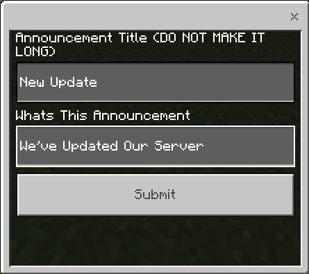
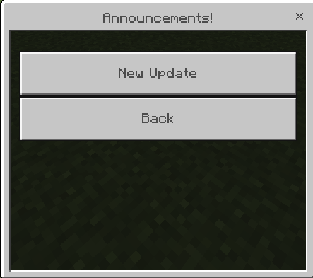

# Announcements System

## Overview
The Announcements System allows admins to create and manage announcements that all players can view. Admins can add new announcements, which are stored globally and accessible by any player. Players can view the list of announcements and read their details. Admins have the additional ability to delete announcements.

---

## Admin View

### Creating an Announcement

Admins can create new announcements using the in-game menu.

**Steps:**
1. Open the Announcements Menu in the Admin Panel
2. A form will appear with the following fields:
   - **Announcement Title**: Enter a short title for the announcement (keep it brief).
   - **Announcement Text**: Enter the content of the announcement.
3. Click "Submit" to save the announcement.

**Example:**

> **Note:** Announcements are saved and can be viewed by all players.

### Deleting an Announcement

Admins can delete any existing announcement.

**Steps:**
1. Open the Community Panel and head over to annoucements
2. Select the announcement you want to delete.
3. Click "Delete Announcement" if you have admin permissions.
4. The announcement will be removed from the system.

---

## Player View

### Viewing Announcements

Players can view the list of current announcements using the in-game menu.

**Steps:**
1. Open the Community Panel and click Announcement
2. A list of announcements will be displayed. Each button corresponds to an individual announcement title.
3. Click on an announcement title to view its details.

**Example:**

