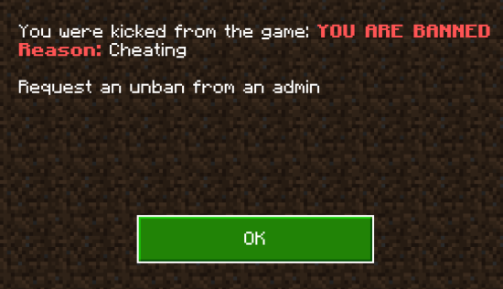

# Ban System

## Overview
The Ban System allows admins to manage player bans directly in-game. Admins can issue temporary or permanent bans. The system automatically kicks banned players upon login if their ban is still active and periodically checks for expired bans.

---

## Admin Commands

### Accessing the Ban Menu

To access the Ban System menu, use the admin panel.

**Options:**
- **Ban**: Opens the form to ban a player.
- **UnBan**: Opens the form to unban a player.

---

## Banning a Player

The Ban Form allows you to select a player, specify a reason, and set the ban duration.

### Steps:
1. Open the Ban Form using the Ban Menu.
2. Fill in the following fields:
   - **Select Player**: Choose the player to ban from a dropdown list of online players.
   - **Ban Reason**: Provide the reason for banning the player (e.g., "Cheating", "Inappropriate behavior").
   - **Ban Duration**:
     - **Days**: Set the number of days for the ban (0 for no days).
     - **Hours**: Set the number of hours for the ban (0 for no hours).
     - **Minutes**: Set the number of minutes for the ban (0 for no minutes).

3. Click "Submit" to apply the ban.
4. The banned player will be immediately kicked from the server with the following message:

> **Note:** Setting all duration fields (Days, Hours, Minutes) to `0` will result in a permanent ban.

---

## Unbanning a Player

The Unban Form allows you to view a list of all banned players and remove bans as needed.

### Steps:
1. Open the Unban Form using the Ban Menu.
2. You will see a list of banned players. Each button corresponds to a specific player.
3. Click on the player's name to remove their ban.
4. The ban will be lifted, and the player will be allowed to join the server again.

---

## Automatic Ban Management

- If the ban has expired, it is automatically removed, and the player is allowed to join.

### Periodic Ban Expiration Check

The system regularly checks for expired bans:
- Expired bans are automatically removed from the list.
- If a player is still banned, the system ensures they are kicked from the server with the appropriate message.

**Example Kick Message:**

---

## Tips for Admins

- Regularly check the Unban Form to manage active bans.
- Use clear and specific reasons when banning players to avoid confusion during appeals.
- Ensure you set the correct duration for temporary bans; setting all fields to `0` will issue a permanent ban.

---

## Future Enhancements

Potential updates to the Ban System may include:
- Adding specific actions (e.g., notifying other admins when a player is banned).
- Integrating ban appeal features for players to request an unban directly in-game.

---
