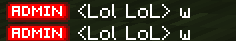

# Ranks

## Overview
The ranks system allows administrators to assign and manage ranks for players. Each player can have up to 3 ranks displayed in chat, with special formatting options available. The system also supports beta ranks with unique glyphs.

## Regular Ranks

### Command Usage
```
!rank <username> <rank>
```

Example:
```
!rank PlayerOne VIP
```

### Features
- Maximum of 3 ranks per player
- Ranks appear in chat as: `[RankName]`
- Default rank of `[Member]` shows if no other ranks are present
- Using the command on a player with an existing rank will remove that rank
- Only players with the `Admin` or `admin` tag can manage ranks

### Formatting Options
Ranks can include color codes and style modifiers:

#### Colors
- `§0` - Black
- `§1` - Dark Blue
- `§2` - Dark Green
- `§3` - Dark Aqua
- `§4` - Dark Red
- `§5` - Dark Purple
- `§6` - Gold
- `§7` - Gray
- `§8` - Dark Gray
- `§9` - Blue
- `§a` - Green
- `§b` - Aqua
- `§c` - Red
- `§d` - Light Purple
- `§e` - Yellow
- `§f` - White

#### Styles
- `§l` - Bold
- `§o` - Italic
- `§k` - Obfuscated

Example with formatting:
```
!rank PlayerOne §c§lAdmin
```
This creates a red, bold "Admin" rank.

## Beta Ranks
Beta ranks are special ranks that display unique glyphs. These are identified by the `obsidian-beta.ranks:` prefix.

### Available Beta Ranks
- `obsidian-beta.ranks:admin`
- `obsidian-beta.ranks:mod`
- `obsidian-beta.ranks:VIP`
- `obsidian-beta.ranks:member`

### Chat Display
The chat format follows this pattern:


## Permissions
- Only players with the `Admin` or `admin` tag can:
  - Add ranks
  - Remove ranks
  - Edit ranks
  - Use the rank management GUI
  - Chat when chat is locked