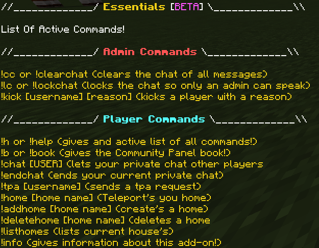

# Custom Commands

## How To Access All Commands?

To access all active commands do `!h` or `!help` in chat, you should see text like the image below

ALL commands are in beta and may change, we have a lot more planned over the next few update!

## How Do I Disable The Info Command?

To disble the info command type `/scriptevent realm:info` like shown below

## I Don't Want A Command Enabled

disabling commands is coming very soon and we hope to get is released sometime this year!