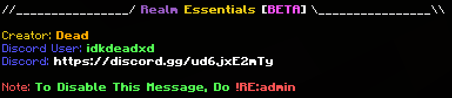

# FAQ
Developed by Dead
## How to setup Obsidian Essentials?
when you join your world for the first time, you "should" see a starter message like shown below

Do `!realm:admin` this will automatically make you a admin in the system, being a admin will give you full access to the add-on!

## How do i disable the info section?
The info section tells your members about Obsidian Essentials to disable this do `/scriptevent realm:info`

We would love if you keep this enabled so your members can also get this add-on!

